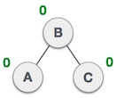

# 2018-Spring

[1a](#1a) | [1b](#1b) | [2a](#2a) | [2b](#2b) | [3a](#3a) | [3b](#3b) | [41](#41) | [4b](#4b) | [5a](#5a) | [5b](#5b) | [6a](#6a) | [6b](#6b) | [7](#7)

##  1a,

>Abstract Data type(ADT)

- ADT is a useful tool for specifying the logical properties of the data type. The definition of ADT only mentions what operations are to be performed but not how these operations will be implemented. It does not specify how data will be organized in memory and what algorithms will be used for implementing the operations. ADT is as a Black box that hides the inner structure and design of the data type. Since ADT hides the implementation of the data types only showing how to use them so, ADT is an abstract data type.

>Data structure as backbone of software programming

- Data structure is a way of storing data in a computer So that it can be used efficiently. With carefully chosen data structure we can use most efficient algorithm. Choosing of a data structure begins with the choice of an ADT(abstract data type). A well-designed data structure allows a variety of critical operations to be performed using a few resources both execution time and memory space as possible. Data structure are implemented by a programming language as data types and the reference and operations they provide. 

##  1b,

>Advantage of Postfix expression over infix expression

-   Any formula can be expressed without parenthesis.
-  It is very convenient for evaluating formulas on computer with stacks.
-  Postfix expression doesn't has the operator precedence.
-  Postfix is slightly easier to evaluate.
-  It reflects the order in which operations are performed.
-  You need to worry about the left and right associativity.

>Infix to Postfix 
>(A+B * C/D)+E * F-(G*H+I-J)

|**Read**|**Stack**|**Output List**|
|---|----|---|
|'('|(||
|'A'|(|A|
|'+'|(+|A|
|'B'|(+|AB|
|'*'|(+*|AB|
|'C'|(+*|ABC|
|'/' `since / has equal precedence as * the operator * has to be poped first and push to output list`|(+/|ABC*|
|'D'|(+/|ABC*D|
|')' `since closing paranthesis is encountered the operators till the opening paranthesis is poped first`||ABC*D/+|
|'+'|+|ABC*D/+|
|'E'|+|ABC*D/+E|
|'*'|+*|ABC*D/+E|
|'F'|+*|ABC*D/+EF|
|'-' `since - has lower precedence than * the operator * has to be poped first and push to output list also - has equal precedence than + so + is also poped and pushed as *`|-|ABC* D/+EF*+|
|'('|-(|ABC *D/+EF *+|
|'G'|-(|ABC *D/+EF *+G|
|'*'|-(*|ABC *D/+EF *+G|
|'H'|-(*|ABC *D/+EF *+GH|
|'+'|-(+|ABC*D/+EF *+GH *|
|'I'|-(+|ABC*D/+EF *+GH *I|
|'-'|-(-|ABC*D/+EF *+GH *I+|
|'J'|-(-|ABC*D/+EF *+GH *I+J|
|')'|-|ABC* D/+EF*+GH * I+J-|
|`since no more character to read remaining operators are poped and pushed to output list`|-(+|ABC *D/+EF *+GH *I+J- -|

##  2a,

>Difference Between recursion and iteration

|**recursion**|**iteration**|
|---|---|
|It is the process of repeating a function over and over again until a base condition is satisfied.| It is the process of repeating a block of code until some condition is satisfied.| 
|We use it for repetition of function.|We use it for repetition of block of code.|
|`return` with calling of the function is used to do recursion.|`for`, `while`, etc loop are used to do iteration.|
|`If  else` statement is used to check the base condition.|Conditions are written inside paranthesis of the loop.|  

>Tower of Hanoi algorithm
	
	Assume we have n disks in source peg and we have 2 other pegs auxiliary and destination peg
	
	Step 1: Move n-1 disks from source to auxiliary peg
	Step 2: Move nth disks from source to destination peg
	Step 3: Move n-1 disks form auxiliary to destination peg

## 2b,

>Advantages of Doubly Linked List(DLL)

- A DLL can be traversed in both forward and backward direction.
- The deletion operation in DLL is more efficient if pointer to the node to be deleted is given
- We can quickly insert the new node before a given node.

>Algorithm for Insertion in a linked list
>At the front of list
	
	[start = points to the first node of the list]
	[->next stands for next node address]
	
	Step 1: create a new node
	Step 2: newnode->next = start 
	Step 3: start = newnode

>Algorithm for Insertion in a linked list
>At the end of list

	Step 1: create a new node
	Step 2: t = start
	Step 3: while(t->next != NULL) t=t->next
	Step 4: t->next = newnode

>Algorithm for Insertion in a linked list
>At the given position or after a node 

	Step 1: create a new node
	Step 2: read the position of the node p
	Step 3: t = start
	Step 4: traverse the list up to position as
	Step 5: newnode->next = t->next
	Step 6: t->next = newnode

>Algorithm for Deletion in a linked list
>From the first of list

	Step 1: t1 = start
	Step 2: start = start->next
	Step 3: delete(t1)

>Algorithm for Deletion in a linked list
>From the end of list

	Step 1: t1 = start
	Step 2: traverse the list up to n-1 node
	Step 3: t1 = t->next
	Step 4: t->next = t->next->next
	Step 5: delete(t1)

>Algorithm for Deletion in a linked list
>From the given position

	Step 1: read the position of the deleted node p
	Step 2: traverse the list up to p-1 node 
	Step 3: t1 = t->next
	Step 4: t->next = t->next->next
	Step 5: delete(t1)

##  3a,

>Balancing AVL tree

- An AVL tree is a BST(Binary Search Tree) that balances the height of the tree.
- It checks the height of right and left sub tree and makes sure the difference is not more than 1.
- When we insert a node that violets the property of AVL tree we can use this 4 methods to balance the tree:-
	- **Left Rotation**
		- If a tree becomes unbalanced, when a node is inserted into the right subtree of the right subtree, then we perform a single left rotation
		
		
		
		- In our example, node **A** has become unbalanced as a node is inserted in the right subtree of A's right subtree. We perform the left rotation by making **A** the left-subtree of B.
		
		
	- **Right Rotation**
		- AVL tree may become unbalanced, if a node is inserted in the left subtree of the left subtree. The tree then needs a right rotation.
		
		
		
		- In our example, node **C** has become unbalanced as a node is inserted in the left subtree of C's left subtree. We perform the right rotation by making **C** the right-subtree of B.

	- **Left-Right Rotation**
		- A left-right rotation is a combination of left rotation followed by right rotation.
		
	|**State**|**Action**|
	|---|---|
	||A node has been inserted into the right subtree of the left subtree. This makes **C** an unbalanced node. These scenarios cause AVL tree to perform left-right rotation.|
	||We first perform the left rotation on the left subtree of **C**. This makes **A**, the left subtree of **B**.|
	||Node **C** is still unbalanced, however now, it is because of the left-subtree of the left-subtree.|
	||We shall now right-rotate the tree, making **B** the new root node of this subtree. **C** now becomes the right subtree of its own left subtree.|
	||The tree is now balanced|
	
	- **Right-Left Rotation**
		- A right-left rotation is a combination of right rotation followed by left rotation.

	|**State**|**Action**|
	|---|---|
	||A node has been inserted into the left subtree of the right subtree. This makes **A**, an unbalanced node with balance factor 2.|
	||First, we perform the right rotation along **C** node, making **C** the right subtree of its own left subtree **B**. Now, **B** becomes the right subtree of **A**.|
	||Node **A** is still unbalanced because of the right subtree of its right subtree and requires a left rotation.|
	||A left rotation is performed by making **B** the new root node of the subtree. **A** becomes the left subtree of its right subtree **B**.|
	||The tree is now balanced|

## 3b,

>BST construction

##  4a,

>Queue

- Queue is a linear list of element in which deletion can take place at one end of the queue called front of the queue and insertion can take place at the other end called the rear.
- The 2 primitive operations of Queue are:-
	- **Enqueue:** It is the process of adding items into the queue from the rear of queue.
	- **Dequeue:** It is the process of removing items from the queue from the front of queue.

>Enqueue in Circular queue

	 Initialize front and rear as 0 and an array Q[]
	 
	 Step 1: Start
	 Step 2: if (front == (rear+1)%max)
	 	 print error "Circular queue overflow"
	 Step 3: else
		 {rear = (rear+1)%max
		 Q[rear] = element;
		 if(front == -1) f=0;
		 }
	Step 4: stop	 	  

>Dequeue in Circular queue

	Initialize element = 0 
	
	Step 1: Start
	Step 2: If((front == rear) && (rear == -1))
		print error "circular queue underflow"
	Step 3: else
		{ element = Q[front]
		 If(front == rear) front=rear=-1
		 Else
		 front = (front+1)%max
		} 
	Step 4: End

## 4b,

>Generating Huffman code

- 

>Huffman tree for "POKHARAUNIVERSITY"

##  5a,

>Sorting

- Sorting is the process in which records are arranged in ascending and descending order.
- It is done to make searching for elements in a list easy.
- There are many ways of sorting, like `quick sort` , `bubble sort`, `merge sort`, etc.

>Algorithm for quick sort

	Step 1: Pick a point for pivot, from the list.
	Step 2: Reorder the list so that all elements with values less than pivot come before the pivot and values greater than pivot comes after the pivot.
	(after reordering the pivot element is in its final position, it is called `partition operation`)
	Step 3: Recursively apply the step 1 and 2 to the sub-list of elements with smaller values and greater values separately.

## 5b,

>Collision in hashing

>Collision resolving technique in hashing

>Separate chaining

##  6a,

>Graph and Digraphs

- A Graph is a set of nodes(or vertices) and a set of arcs(or edges). Each arc in a graph is specified by a pair of nodes.

- The graph is said to be Digraphs(Directed graphs) if the pairs of nodes(vertices) that makes up the arcs (edges) are ordered pairs.

>Adjacency matrix representation of graph

- A adjacency matrix is a square matrix used to represent a finite graph.
- 

## 6b,

>Minimum spanning tree

- Minimum spanning tree is a subset of the edges of a connected, edge-weighted undirected graph that connects all the vertices together, without any cycles and with the minimum possible edge weight.

>Kruskal's algorithm for finding minimum spanning tree

	Step 1: Sort all the edges in non-decreasing order of their weight.
	Step 2: Pick the smallest edge. Check if it forms a cycle with the minimum spanning tree formed so far. If cycle is not formed, include this edge.
		Else Discard it.
	Step 3: Repeat step 2 until there are (v-1) edges in the minimum spanning tree. {where v = vertices in the spanning tree}

## 7,

>Static vs Dynamic list

|**Static list**|**Dynamic list**|
|---|--|
|The memory allocaion is done during compile time.|The memory allocation is done during run time.|
|Data is stored in stack.|Data is stored in heap.|
|Data cannot be changed during the program.|Data are determinted during the program.|
|The max size of the list is pre determined.|The max size of the list can be determined during run time.|

>Deterministic and non-deterministic algorithm

|**Deterministic algorithm**|**Non-deterministic algorithm**|
|----|---|
|The algorithm in which the output is always same for the given input is called deterministic algorithm.|The algorithm in which the output is different for the same given input is called non-deterministic algorithm.|
|Can solve the problem in polynomial time.|Can't solve the problem in polynomial time.|
|Can determine the next step of execution.|Cannot determine the next step of execution due to more than one path algorithm can take.|