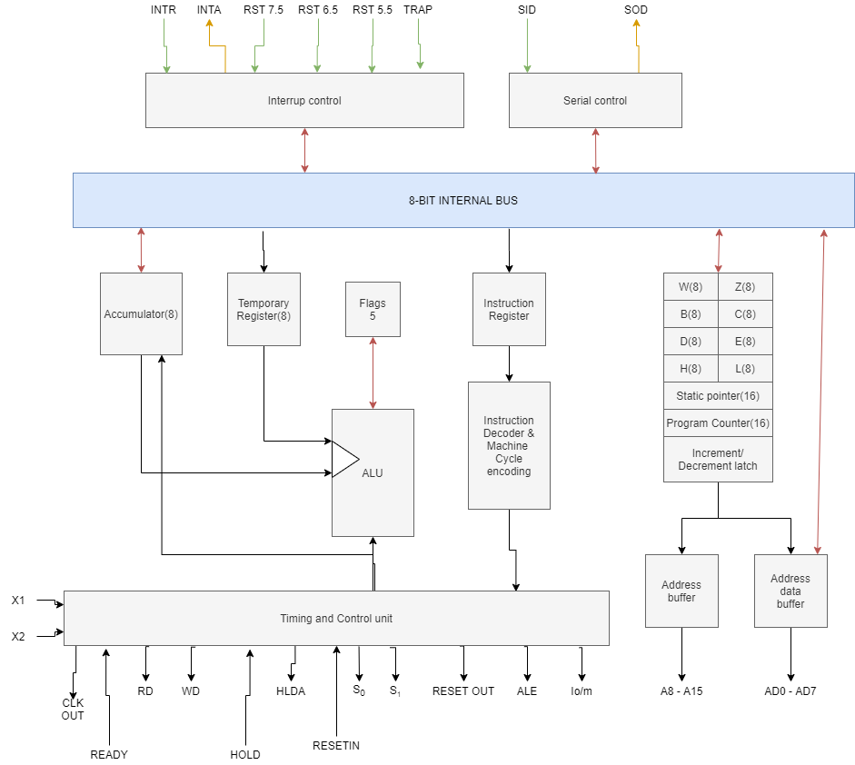
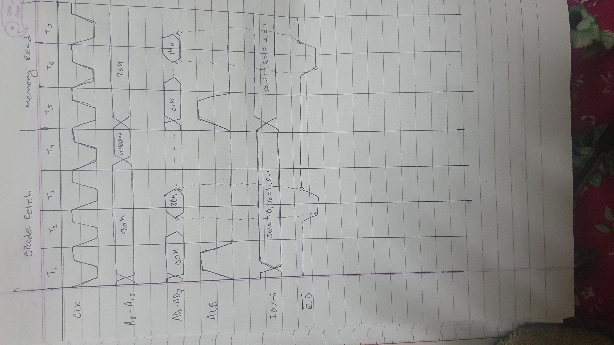

# 2012 - Fall

## 1a,

- `Addressing mode` is a techinque of specifiying the operand for the given instruction.
- It specifies a specific rule for interpreting or modifyingthe address field of the instruction before the operand is actually executed.
- They are useful because:-
    - They reduces the size of the program by decreasing the size of address flag.
    - They increase the flexibility for programmers to choose the instruction.

- Different addressing modes of 8086 intel microprocessor are:-
    - **Register addressing mode**
        - It is a simple form of addressing mode. It transfers a data(`8-bit or 16-bit`) from the source register to the destination register.
        - It can use both 8-bit `AH, AL, BH, BL, etc` or 16-bit `AX, BX, DX, etc` registers.
        - _**`Example: Mov Ax, Bx, Mov AL, BH, etc`**_
    - **Immediate addressing mode**
        - It is the addressing mode that deals with the constant data or the data directly.
        - It transfers the immediate(direct) data to the destination register.
        - _**`Example: Mov Ax, 23H| Mov Cl, 90(decimal) ,etc`**_
    - **Direct addressing mode**
        - It is the addressing mode that uses a offset address of the operand in the instruction.
        - We have a offset value that is used to find the direct address of the operand.
        - _**`Example: MOV AL, [1234H] | ADD BL, [0301], etc`**_
    - **Indirect addressing mode**
        - In this addressing mode the offset address of the direct address is stored in another one of the `Bx, SI, BP or DI` register which is then used in the instruction.
        - _**`Example: MOV CL, [SI] | MOV AH, [DI], etc`**_
    - **Base plus index addressing mode**
        - In this addressing mode the offset address is stored in the resultant of a base register(`Bx or Bp`) and index register(`SI or DI`).
        - _**`Example: MOV CL, [BP+SI] | MOV AL, [Bx+DI], etc`**_
    - **Register relative addressing mode**
        - In this addressing mode one of the (`base or index`) register is added with a constant to get the offset address, which is then used in the instruction.
        - _**`Example: MOV BL, [Bx+05] | MOV AL, [DI+11] ,etc`**_
    - **Base relative plus index addressing mode**
        - In this addressing mode the offset value is calculated by adding the base register, index register and a constant value.
        - _**`Example: MOV CL, [BP+DI+06], etc`**_

## 1b,

- A 8085 microprocessor is known as `8-bit microprocessor` because the width of the data bus of 8085 is of 8-bit, _i.e only 8-bit data can be transfered from or to the 8085 microprocessor at a single unit time`(parallely)`_.
- Though Intel 8085 microprocessor needs 16-bit data the 8 MSb are transfered through the A-bus where as 8 LSb are transferred through AD-bus. And 8085 either only transfers data through A-bus or through AD-bus at a time. So 8085 is known as a 8-bit microprocessor.

- **8085 microprocessor block diagram**



- As from the diagram we can see the components of the 8085 microprocessor. The functionality of each components are described below:-
    - **Accumulator**
        - It is a 8-bit general purpose register used to store 8-bit data and performs the arthmetic and logical operations with ALU.
    - **ALU**
        - It is used to perform the arthmetic and logical operation. It recieves the operands from the accumulator and temporary register.
    - **Temporary Register**
        - It a non-accessable 8-bit register used to hold data for a certain period of time and sends it to ALU for calculation.
    - **Flag**
        - It is a 8-bit register consisting of 5 flipflops.It is used to determine the current status of the operation performed in ALU
    - **Register Array**
        - **General purpose Register**
            - They are the user accessable 8-bit registers used to store data. They are `A,B,C,D,E,H, and L`
        - **Temporary Register Pair**
            - The unaccessable 16-bit register consisting of W(8-bit) and Z(8-bit) register used by MP for storing data temporarily.
        - **Special Purpose Register**
            - *Stack Pointer*
                - 16-bit register used to point the address of the first instruction.
            - *Program Counter*
                - 16-bit register used to point the address of the next instruction to be fetched.
            - *Increment/Decrement address latch*
                - 16-bit register used to increment or decrement program counter after each fetch.
            - *Instruction Register*
                - 8-bit non-accessable register used to pass the data from internal bus to instruction decoder.
            - *Instruction Decoder*
                - Decodes the instruction.
        - **Timing and Control unit**
            - It is used to synchronize all the microprocessor operation with clock and generates control signal necessary for the communication between microprocessor and peripherals.
        - **Interrupt Control**
            - It accepts different interrupts like TRAP, RST 7.5, INTR, etc
        - **Serial Input/Output Control**
            - It is used to accept and send serial one bit data.

## 2a,

- **Timing diagram of MVI A, 14H**

|address|mnemonics|opcode|
|--|--|--|
|2000H|MVI A, 14H|3EH|
|2001H|----------|14H|



## 2b, Write a program to copy the content of "TBL1" which contains 10 numbers into "TBL2".

[Similar to 2013-Fall 3b](https://github.com/Alson33/Notes_Old_question_solutions/blob/master/3rd-Semester/MP/old_questions/2013-fall.md)

## 3a, WAP to search smallest interger in an array called NUMBERS and place its value in lower byte in BX.

## 3b, WAP to display string "string 1" into a standrad output device using DOS/BIOS interrupt.

```js
title "Display string 1 in screen"

.model small
.stack 100h

.data
    str DB "string 1$" ;$ is the end of the line

.code
    main Proc
        mov ax, @data
        mov ds, ax

        lea dx, str ;load effective address of str
        mov ah, 09h ;to display string
        int 21h

        mov ax, 4c00h
        int 21h
    main endp
    end main

```

## 4a,


            