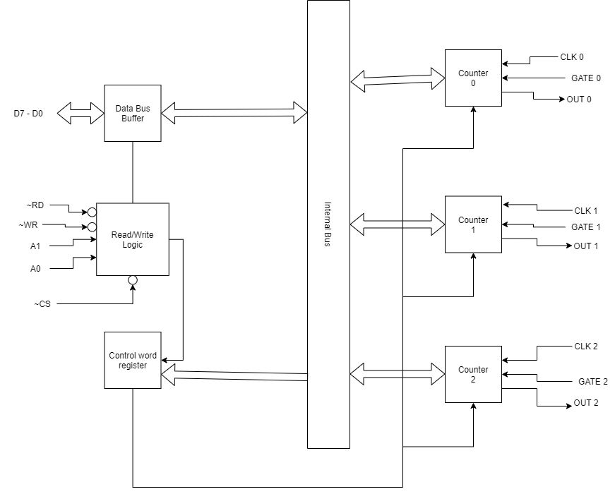

# 2017-Spring

## 1a, 

- // TODO

## 1b, Block diagram of 8086 microprocessor and Explain its Execution Unit.

//TODO: Figure

- **Execution Unit(EU)**
	- The execution unit of 8086 receives instruction from queue in BIU, decodes instructions and executes instructions. The EU contains the arithmetic and logic (ALU), a control unit and a number of registers. It has ten 16-bit registers which are `AX, BX, CX, DX, SP, BP, SI, DI, Flag register and Operand register.` First four can be used as 8-bit register `(AH, AL, BH, BL, CH, CL, DH, DL)` each.
	- **AX register**
		- It is called 16-bit accumulator. AH and AL are called 8-bit accumulator.
	- **BX register**
		- It is known as the Base register since it is the only general purpose register that can be used as an index to extend addressing.
	- **CX register**
		- It is known as counter register because some instructions such as SHIFT, ROTATE and LOOP use the contents of CX as the counter.
	- **DX register**
		- It is known as data register. Some I/O operations require its use for multiplication and division operations that involves large values.
	- **Stack pointer(SP) and Base pointer (BP)**
		- Both are used to access data in the stack segment. The SP is used as an offset from the current stack segment during execution of instruction.The BP contains the offset address in the current stack segment.
	- **Index register**
		- The 2 index registers SI(Source index) and DI(Destination Index) are used in index addressing. The instruction that process data string use the SI and DI index register together with DS and ES respectively in order to distinguish between the source and destination address.
	- **Flag register**
		- The flag register is used to determine the current status of the operations performed in ALU. The 8086 consists of 9 flags among which 5 are like 8085 flags and remaining 4 are new flags.

|X|X|X|X|O|D|I|T|S|Z|X|AC|X|P|X|CY|
|--|--|--|--|--|--|--|--|--|--|--|--|--|--|---|--|
|D15|D14|D13|D12|D11|D10|D9|D8|D7|D6|D5|D4|D3|D2|D1|D0|

1. **O (Overflow flag):** 
2. **D (Direction flag):** 
3. **I (Interrupt flag):** 
4. **T (Trap flag):** 
5. **S (Sign flag):**
6. **P (Parity flag):**
7. **Z (Zero flag):**
8. **AC (Aux flag):**
9. **C (Carry flag):**

- **Operand register:** It is a temporary register which cannot be accessed by the user. It is used by the microprocessor to hold data for certain period of time.
- **ALU:** ALU performs arithmetic and logical operations. It receives two operands for calculation and provides result after calculation.

## 2a, 

i, MOV A,B
ii, MVI A, 32H
iii, LXI H, 2030H

|Instruction|Function|Addressing mode|Size|Machine Cycles|
|--|--|--|--|--|
|MOV A, B|||||
|MVI A, 32H||||
|LI H, 2030H||||

## 2b, 

[2018-Spring 2b]()

## 2c, Timing diagram of IN 34H

|Memory Address|Instruction|Opcode|
|--|--|--|
|2000H|IN 34H||
|2001H|------|34H|

## 3a,

- // TODO

## 3b,

[2018-Spring 3b]()

## 3c,

[2018-Spring 3c]()

## 4a,

[2019-Spring 4a]()

## 4b,

- // TODO

## 5a, Interrupt process. Explain vector chain and polled interrupt

[Interrupt process 2019-Spring 5a]()

## 5b, 

- // TODO

## 6a, 

- // TODO Explain

## 6b, 

## 6c, Control words of 8255A PPI

- // TODO

## 7,

### a,

[DMA Controller 2018-Spring 7a]()

### b, Macro Assembler

- Macro Assembler is a special type of assembler which is used to assemble a macro assembly langauge program. A macro assembly language program is that ALP which consists of macros.
- The macro Assembler finds all the macro refreneces`(i.e macro names)` from the code segment of the program and replaces it with the instruction written within the macro defination.
- As macro needs to be replaced instead of calling like a proceudre we need special kind of assmebler which is known Macro Assembler

### c, 

[8085 flag register 2018-Spring 7c]()
