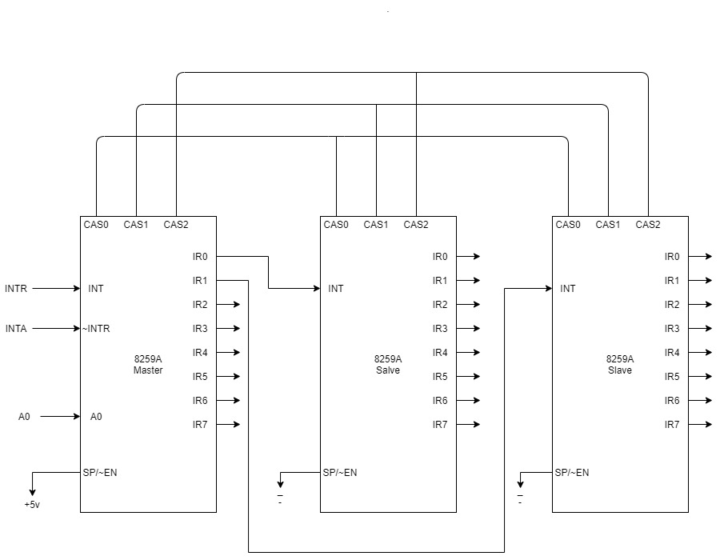
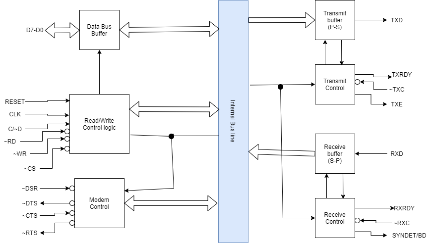

# 2018-Fall

## 1a, 

[Same as 2018-spring 1a]()

## 1b,

[same as 2012-fall 1b part 2]()

## 2a, Timing diagram of LDA CBD2H

|address|Mnemonics|Hexcode|
|--|--|--|
|2000H|LDA CBD2H||
|2001H||D2H|
|2002H||CBH|

## 2b, What is addressing mode? Describe different addressing modes in 8085 microprocess.

- `Addressing mode` is a techinque of specifiying the operand for the given instruction.
- It specifies a specific rule for interpreting or modifyingthe address field of the instruction before the operand is actually executed.
- They are useful because:-
    - They reduces the size of the program by decreasing the size of address flag.
    - They increase the flexibility for programmers to choose the instruction.
- Different addressing mode of 8085 are:-
    1. **Immediate addressing mode** 
		- If the 8-bit or 16-bit operand/data are immediately expressed within an instruction then it is called immediate addressing mode. For 8-bit data the instruction size is 2 bytes, for 16-bit data the instruction size is 3 bytes. _Example: MVI A, 29H, MVI M, 35H, LXI B, 2050H, ADI 35H, SUI 35H, XRI 55H, etc_
	1. **Register Direct addressing mode**
		- If the operands are stored in general purpose register and the operation is between register that are expressed in the instruction then it is called register direct addressing mode. The instruction size is of 2 or 3 bytes, first byte opcode followed by 1 or 2 bytes of address of data. _Example: MOV A, B, ADD B, ANA D, ORA C, XCHG, etc_
	1. **Direct addressing mode**
		- If the operand's effective address (address where the operand is stored) is expressed within an instruction then it is called direct addressing mode. _Example: STA 2050H, LDA 2050H, SHLD 2050H, IN 01H, OUT 01H, etc_
	1. **Register indirect addressing mode**
		- If the register pair which contain the address of data is specified within an instruction then it is called indirect addressing mode. Here register pair holds the memory location. _Example: LXI D, 2030H-->STAX D, LXI B, 1010H--> LDAX B, MOV A, M, etc_
	1. **Implied or inherent addressing mode**
		- If the opcode in an instruction tells about the operand but the operand is not visible within an instruction then it is called implied addressing mode. _Example: HLD, HLT, NOP, CMA, EI, RAL, etc_

## 3a, Describe the format of an ALP, illustrate a simple program.

- A typical format of ALP contains the label, opcode, operand and the comment.
- First we write the `label`, it is optional in the syntax. It is written for future reference _(like JMP)_.
- Then follows the `Opcode(Operation code)`, it is the required field and contains the code for what operation to be performed _(like MOV, ADD, etc)_.
- Then comes `Operand or data` part that contains all the datas(maybe register, 8-bit/16-bit data or address, etc). It is mostly written except for some instruction which contains the operands within opcode(ex:- RRC, CMA, etc)
- Finally comes the `comment` part it starts with a semi-colon `(;)`. It is used to make a well documented ALP programs.

Example:- LOOP ADD B ;adds content of register A and B
|Label|Opcode|Operand|Comment|
|--|--|--|--|
|LOOP|ADD|B|;adds content of register A and B|

- As seen in the table above the `LOOP` is the `Label` used for future references.
- `ADD` is the `opcode` for addition operation.
- `B` is a general purpose register which is an `operand` in this instruction.
- Finally `;adds content of register A and B` is the `comment` which is ignored by the assembler and simply functions as a documentation purpose and is ignored by the assembler.

## 3b, WAA for 8085 MP to copy the largest value among ten values at starting address CB08H to CD00H

- //TODO

## 4a, WAA to find difference between two 8-bit numbers using two's complement and display the difference in the screen.

- // TODO

## 4b,

[Same as 2019-spring 7c]()

## 5a, Differentiate between sychronous and asynchronous bus.

|Sychronous Bus|Asynchronous Bus|
|--|--|
|In Sychronous Bus the occurance of an event is determined by a clock.|In Asychronous Bus the occurance of an event is depenedent on occurance of previous event.|
|It is slower than Asyhchronous Bus.|It is faster than Sychronous Bus.|
|It is easier to implement.|It is difficult to implement.|
|Data transfer takes place in block.|Data transfer is character oriented.|
|Data bits are transmitted with synchronization of Clock.|Data bits are transmitted at a constant rate.|
|Sychronous Buses are high speed buses.|Asychronous Buses are low speed buses.|

## 5b, List out the possible sources of interrupts. Also describe the polled interrupt hardware with necessary diagram.

[Sources of interrupts 2018-Spring 5a]()

- // TODO

## 6a, Explain 8259A modes of operation.How can we accomodate 18 interrupt sources with 8259A PIC?

- The modes of operation in 8259A are:-

    1. **Fully Nested Mode**
        - This is the general purpose mode in which all IRs(Interrupt requests) are arranged from higher to lower priority, with IR0 as the highest and IR7 as the lowest.
        - Additionally any IR can be assigned the highest priority in this mode and the priority sequence will begin from that IR.
    1. **Rotating Priority mode**
        - It is further divided into 2 modes:-
        1. **Automatic Rotation Mode**
            - In this mode, a device or IRx after being serviced receives the lowest priority and the IRx+1 recieves the highest priority.
        1. **Specific Rotation Mode**
            - This mode is similar to the automatic rotation mode except that the user can select any IR for lowest priority, thus fixing all other priorities.
    1. **Special Mask Mode**
        - In this mode, by programming the mask register, it is possible to selectively enable the interrupts.
        - We can enable this mode by masking ESMM and SMM bits as '1' in operation control word OCW3.
    1. **Polled Mode** 
        - In this mode of operation INT output of the 8259A is either not connected to INTR of MPU or the system interrupts are disabled by the software.

- We can accomadate 18 interrupts sources with 8259A PIC by connecting three 8259A PICs in cascade. We can do so by connecting 3 PICs in following manner:-
    1. One of the 8259A is made master by connecting SP/~EN pin to +5v and remaining two 8259As are made slave by connecting their SP/~EN pin to GND
    1. INT pin of each slave is connected to IR pin of master 8259A.
    1. The cascade buffer lines(CAS0-CAS2) of master 8259A must be connected to cascade buffer lines(CAS0-CAS2) of each slave.
    1. The INT pin of master 8259A is connected to INTR pin of the microprocessor whereas the INTA pin of master 8259A is connected to INTA pin of microprocessor and the address line A0 to the address line of the MPU.

_**Figure: Cascading three 8259As**_

## 6b, Describe in detail the working mechanism of USART with necessary diagram.

_**Figure: USART Block Diagram**_

- USART (Universal Synchronous Asynchronous Receiver Transmitter) is a serial data communication device that receives serial data form CPU convert it and transmit serial data, Also vice versa.
- The components a USART has are:-
    1. **Data Bus Buffer:** It is a 3-state bidirectional, 8-bit buffer used to interface the USART to the system data bus.
    1. **Read/Write Control logic:** It manages the reading and writing of data. It consists of following signals: `RESET, CLK, WR, RD, C/D and CS`
    1. **Modem Control:** The 8251A USART has the set of control input and outputs that can be used to simplify interface to almost any modem. It has the following signals:- `DSR, DTR, CTS and RTS`
    1. **Transmit Buffer:** It accepts the parallel data from Data Bus Buffer, converts it to a serial bit stream, inserts appropraite bits or characters and outputs a serial stream of data on TXD output pin.
    1. **Transmit Control:** It manages all the activities associated with the transmission of serial data. It has following signals: `TXRDY, TXE and TXC`
    1. **Receive Buffer:** It accepts the serial data, converts the serial data to parallel format and sends it to the CPU. The data is input to RXD pin.
    1. **Recieve Control:** It manages all the receiver related activities and consists of the following signals: `RXRDY, RXC and SYNDET/BD`

## 7

### a, Addressing Decode

- The process of generating Chip Select signal(~CS) using the address lines of the microprocessor and a decoder or logic-gates, to interface memory device or IO device with microprocessor is called address decoding. `// uncomplete`

### b, Interrupt Vector Table

- An `Interrupt vector` is a 4-byte number stored in the first 1024 bytes of the memory`(00000H - 003FFH)`. There are `256` different interrupt vectors. Each vector contains the address of an interrupt service routine.
- The address is contained in `IP and CS`.
- Thus, `interrupt vector table` is a 1024 bytes sized table that contains the addresses of interrupt service routine.
- The purpose of an **IVT** is to hold vector that redirects the microprocessor to the correct service routine when an interrupt arrive.
- The first lower 5 types are dedicated to specific interrupts, they are `Type 0(Divide by Zero), Type 1(Single step), Type 2(Non-maskable), Type 3(Breakpoint), Type 4(Overflow)`.

### c, Application of 8254 PIT

- // TODO