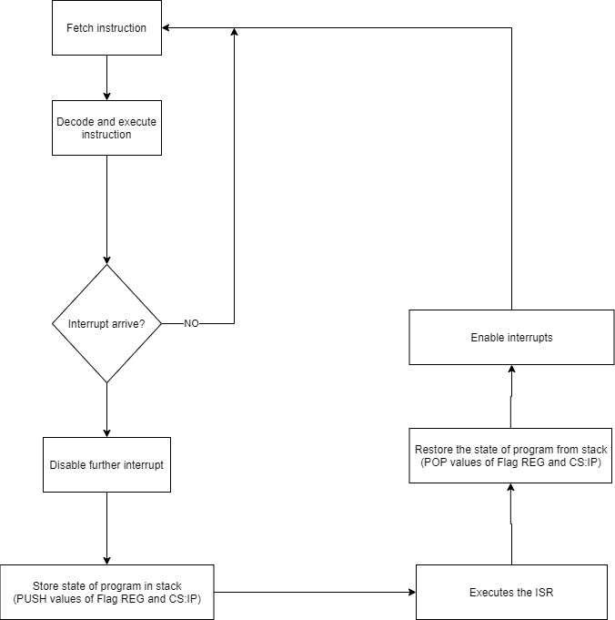
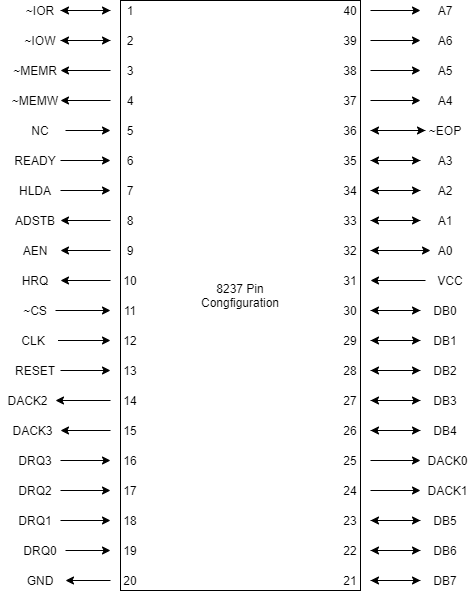
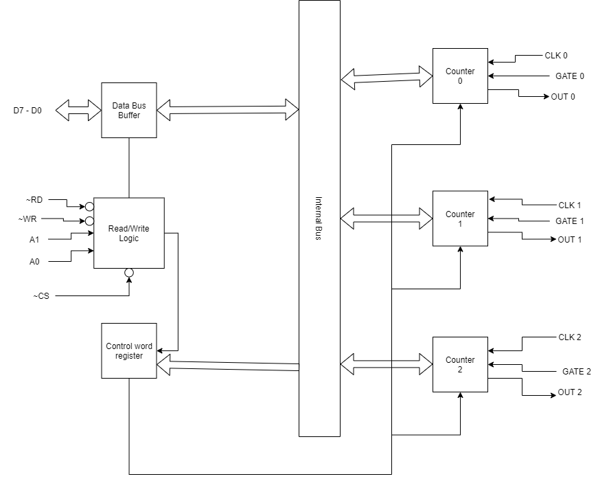

# 2019 - Spring

## 1a, Define opcode and operand with example.

- **Opcode:** 
    - It is a portion of machine langauge   instructions that specifies what operation is to be performed. It is the short form for `Operation code.`
    - Every instruction in microprocessor have opcode present in them. They can be the code used by the MP to find the operation to be performed or can be the operation itself.
    - _**Example: MOV AL, BL `[MOV is a opcode]`, JMP 2050H `[JMP is the opcode]`, CMA `[CMA is the opcode]`, etc**_
- **Operand:**
    - It is the other portion of the machine language instruction that holds the data to be operated or the memory address of the data or memory address where the data should be placed.
    - Unlike Opcode some machine language instructions doesn't have any operands. Depending on the number or size of the operand instruction are divided into categories like `0-bit address instruction`, `1-bit`, `2-bit`, etc.
    - Example ADD B, `[B is the operand]`, LDA 2030H, `[2030H is the operand]`, etc

### Differentiate between microprocessor and microcontroller.

|Microprocessor|Microcontroller|
|--|--|
|It is a silicon chip representing a CPU which is capable of performing arthmetic as well as logical operations according to a predefined set of instruction.|It is an interagted chip that contains a CPU, stratchpad RAM, special and general purpose register arrays, on Chip ROM/flash memory for program storage, timer and interrupt control unit.|
|The power consumption is high.|The power consumption is low.|
|It has no power saving mode and has relatively slower processing power.|It has power saving mode and is faster than MP|
|Less number of register is used.|More number of register is used.|
|Example:8085,8086,etc.|Example:8051,Zilog,etc.|

## 1b, What is instruction cycle?

- It is a fetch-decode-execute cycle that CPU follows from boot-up to the shut down of the computer in order to process the instrcution provided.
- It ususally consists of 3 main stage fetch (where it fetch the instruction from the main memory to the `instruction register`), decode (where it decodes the instruction and finds out what is to be performed) and execute (where it actually tells the CPU to execute the instruction).

### Timing diagram for MVI M, 20H

[Similar as 2012 2a]()

## 2a, Describe the instruction set of 8085 microprocessor on basis of its operation.

- Instruction are the commands given to the microprocessor to perfrom a specific task. In 8085 on the basis of its operation the instruction set are divided into 5 groups which are:-

    1. **Data transfer group**
        - They are the instruction set that transfers or simply moves the data from one register to another or register to memory address or memory address to register or register to I/O port or I/O port to register.
        - Transfer from one memory to another is invalid. They does not affect any flag.
        - _**Example: MOV R<sub>1</sub>, R<sub>2</sub> or MOV R, M**_
    1. **Arithmetic group**
        - They are the instruction set that does all the arithmetic operations like addition, subtraction, multiplication, etc.
        - These instruction affect flag.
        - _**Example: ADD B, SUI, etc**_
    1. **Logical group**
        - They are the instruction set that used to operate on logical operation such as ANDing, ORing, Shifting, etc.
        - These instruction affects flag.
        - _**Example: CMP R, CPI 20H, etc**_
    1. **Branching group**
        - They are the instruction set that are used when the sequence of the program either conditionaly or unconditionaly.
        - They only change the course of the program form one memory address to another memory address that maybe jumping back to older memory address, jumping few memory address or just move to another set of memory address block.
        - _**Example: JMP 1010H, JNC 2050H, etc**_
    1. **Control group**
        - They are teh instruction set that are used to perform some control operation such as enabling or disabling interrupts, no operation, etc.
        - _**Example: NOP, HTL, etc**_

## 2b, WAP to find sum of given series 1 + 2<sup>2</sup> + 3<sup>2</sup> + ... + 10<sup>2</sup> Store the result in memory address 2040H and 2041H.

|Memory address|label|mnemonics|Hexcode|Comment|
|--|--|--|--|--|
|0000H||MVI C, 0AH|Hexcode of MVI C|C <-- 10|
|0001H||-------|0AH||
|0002H|LOOP|MOV A, C|Hexcode of MOV A,C|A <-- (c)|
|0003H||ADD C|Hexcode of ADD C|A <-- (A+C)|
|0004H||DCR C|Hexcode of DCR C|C <-- (C-1)|
|0005H||JNZ LOOP|Hexcode of JNZ|Jumps to LOOP if result c not equal to 0|
|0006H||-----|02H||
|0007H||-----|00H||
|0008H||STA 2040H|Hexcode of STA|2040H <--- (A)|
|0009H||-----|40H||
|000AH||-----|20H||
|000BH||HTL|CFH||

### _**`not correct`**_

## 3a, Indentify the size, addressing mode, T-states and function of the following instructions.

1. MVI A, 20H
1. LDA 1234H
1. CMP M
1. RRC
1. ANA B
1. ADI 0FH
1. LXI H, 1234H

|Instruction|Size|Addressing mode|machine cycles|T-states|Function|
|--|--|--|--|---|--|
|MVI A,20H|2-byte|Immediate addressing mode|1,Opcode fetch cycle(4T)<br>2,Memory read cycle(3T)|7T|It moves the 20H data to the accumulator|
|LDA 1234H|3-byte|Memory addressing mode|1,Opcode fetch cycle(4T)<br>2,Memory read cycle(3T)<br>3,Memory read cycle(3T)<br>4,Memory read cycle(3T)|13T|It loads the data at the memory location 1234H to the accumulator|
|CMP M|1-byte|implied addressing mode|1,Opcode fetch cycle(4T)|4T|It compares the data at the memory location M with the data at the accumulator|
|RRC|1-byte|Implied addressing mode|1,Opcode fetch(4T)<br>|4T|It rotates the content of accumulator to the right without considering the carry|
|ANA B|1-byte|Register addressing mode|1,Opcode fetch(4T)<br>|4T|It logically `And's` the content of accumulator with the content of the register B|
|ADI 0FH|2-byte|Immediate addressing mode|1,Opcode fetch(4T)<br>2,Memory read(3T)|7T|It immediately adds the data 0FH with the content of accumulator.|
|LXI H, 1234H|3-byte|immediate addressing mode|1,Opcode fetch(4T)<br>2,Memory read(3T)<br>3,Memory read(3T)<br>|10T|It moves the 16-bit data 1234H immediately to the register pair H and L|

## 3b, What is macro and how it is implemented for ALP?Explain program using macros.

- Macros are like inline functions of a Assembly lagauge program. It is a set of instruction or sequence of instruction having a specific name and can be used multiple times on the program.
- We can create a Macro sequence instruction and give it a name which can be used later on the program whenever the set of instruction is needed.
- A macro assembler is used to assemble the code written in macro langauge. The macro assembler replaces the instructions within the macro at the places where it finds the macro name. So macros are usefull if the instruction set used inside macro are small otherwise the size of the program will be bigger.
- Although rather then using procedures which cause `call overhead` MACROS doesnot create any overhead.
- In order to implement a macro in ALP we use the `assembler directives`: **MACRO** and **ENDM**

```js
//Syntax:

macro_name  MACRO [...]
              ....
            ENDM
```

- In the above syntax **macro_name** is the `macro name`, **MACRO and ENDM** are the `assembler directives`, inside them are the `instructions` to be used and inside **brackets** are the `list of parameters`.
- Now we can use the **macro_name** instead of writing all the instructions again whenever they are needed in the program.

```js
//Example:
title Macro_Example // title of program

ADDITION  MACRO [num1, num2] // macro defining
            MOV AX, num1
            MOV BX, num2
            ADD AX, BX
          ENDM

.model small 
.stack 100h

.code // start of codes
    ADDITION [21xH, 20xH] // adding 21xH and 20xH
    MOV CX, AX // moving content of AX to CX 
end // logical end
```

## 4a, WAP ALP in 8086 to find the sum of 2 numbers inputed by users and display sum in screen.

```JS
TITLE "Sum of two numbers"

.model small
.stack 100h

.code
    MOV ah, 1 ;ask for input
    int 21h ;interrupts all action until pervious command executed
    MOV bl, al ;move the first input to bl
    MOV ah, 1 ;ask another input
    int 21h
    ADD bl, al ;adds the ascii codes of the input number
    SUB bl, 48 ;subtract 48 to get the real ascii code
    MOV dl, bl ;move the result to dl REG as display of data is done from dl REG
    MOV ah, 2 ;command to display
    int 21h
    MOV ah, 4ch ;gets out of the display command
    int 21h
end

```

## 4b, Desing an address decoding circuit to interface an input device with eight input switches and eight LEDs output device at address 50H and 51H respectively.

// TODO

## 5a, Explain interrupt processing in details. Describe methods of handling multiple interrupts.

- Interrupt is the emergency signal that is when received by the microprocessor it stops all the instructions execution and completes the interrupt's service routine `(ISR)` first.
- The processing of handling interrupt goes as follows:-
    
    1. The processor checks for interrupts. If interrupt has occured, the processor will complete the instruction currently being executed.
    1. The processor will disable further interrupts.
    1. The processor stores the current state of the program `(i.e the flag register and CS:IP)` into the stack using PUSH operation.
    1. Then the processor will load the address of the ISR and execute the ISR. At the end of ISR instruction IRET is used to return the processor from ISR back to main program.
    1. After that the processor restores the previous state of the program `(i.e it will restore the value of flag register and CS:IP from stcak by POP operation)`
    1. Finally the program enables the interrupts and then starts program executin from where it has been interrupted.


 _**Figure: Interrupt process**_

- In case of multiple interrupts // TODO

## 5b,

- An `Interrupt vector` is a 4-byte number stored in the first 1024 bytes of the memory`(00000H - 003FFH)`. There are `256` different interrupt vectors. Each vector contains the address of an interrupt service routine.
- The address is contained in `IP and CS`.
- Thus, `interrupt vector table` is a 1024 bytes sized table that contains the addresses of interrupt service routine.
- The purpose of an **IVT** is to hold vector that redirects the microprocessor to the correct service routine when an interrupt arrive.
- The first lower 5 types are dedicated to specific interrupts, which are described below:-
    - **Type 0`(Divide-By-Zero)`Interrupt**
        - This type of interrupt is performed by the MP when the result of a division is overflowen or there is an attempt to divide by 0.
    - **Type 1`(Single-Step)`Interrupt**
        - This type of interrupt is performed when the instruction is hold and the users direction is needed before executing the next instruction. In this mode the system will execute only one instruction then the user can check contents of register and memory location to confirm next instruction execution.
    - **Type 2`(Non-Maskable)`Interrupt**
        - This type of interrupt is non-disable interrupt and is activated when there is a low to high transition on 8086 `NMI(Non-maskable interrupt) input pin`
    - **Type 3`(Breakpoint)`Interrupt**
        - It is used to implement breakpoint function in the system. It is produced by execution of the `INT3 instruction`. It is often used as a debugging aid in cases where single stepping provides more detail then wanted.
    - **Type 4`(Overflow)`Interrupt**
        - When the result of arthmetic operation between 2 signed numbers is too large to be represented in the destination register or memory location then type 4 interrupt is performed and Overflow flag(Of) is set.

## 6a, Pin configuration of 8237 controller and explain the types of modes available in it.



_**Figure: Pin configuration of 8237 controller**_

- The modes of a 8237 controller are divided into two cycles:-

    1. **Idle cycle**
        - When no channel is requesting service, the 8237 will enter in idle cycle. In this cycle, the 8237 sample DREQ lines every clock cycle to determine if any channel is requesting DMA service.
    1. **Active cycle**
        - When the 8237 is in the idle cycle and channel request DMA service, the device will output an HRQ to the microprocessor and enter into the active cycle. In this mode the DMA trasnfer occurs in one of the four modes:-
            
            1. **Single Transfer Mode** 
                - In this mode the device is programmed to make one transfer only, the word count will be decremented and the address decremented or incremented following each transfer.
            1. **Block Transfer Mode**
                - In this mode the device is activated by DREQ to continue making transfer during the service until Terminal Count(TC) caused by word count going to zero or an external End Of Process (~EOP) is encountered.
            1. **Demand Transfer Mode**
                - In this mode the device is programmed to continue making transfer until a TC or external ~EOP is encountered or until DREQ line goes inactive.
            1. **Cascade Transfer Mode**
                - This mode is used to cascade more than one 8237 together for simple system exapnsion. The HRQ and HLDA signals from additional 8237 are connected to the DREQ and DACK signal of a channel of the initial 8237

## 6b, Draw labelled diagram of 8254 PIT controller.



_**Figure: 8254 PIT Controller**_

### Instruction to generate 5KHz square wave for 8254 PIT.

```
Given:
    Mode of operation  = Mode 3(Square wave generator)
    Frequency of square wave = 5 KHz

Assume:
    Frequency of Clock be 5 MHz
    Counter = counter 1

    Address of counter 0 = 80H
    Address of counter 1 = 81H

then
               Frequency of Clock
    Count = ------------------------
            Frequency of square wave
            5 MHz    5000 KHz
          = -----  = --------
            5 KHz     5 KHz
                   = 1000
    Control word = |Sc1|Sc0|RW1|RW0|M2|M1|M0|BCD/Binary|
                 = |0|1|1|1|0|1|1|1|
                 // Sc1=0,Sc1=1 as we used counter 1
                 // RW1=1,RW2=1 as we have to read or write lower byte folllowed by upper byte
                 //M2=0,M1=1,M0=1 as we have Mode 3
                 //last bit=1 as the result will be in BCD
                = 77H
Subroutine program:
    MVI A, 77H
    // TODO remaining
```

## 7,

### a, Application of PIC 

- //TODO

### b, One pass and Two pass assemblers

- A **One pass assembler** is the type of assembler that passes through the program only once to assemble the
program. This type of assembler collects the labels, resolves future reference and does the actual assembling
process in a single pass or check.
    - It doesnot create any intermediate code, instead is directly generates the target code or the machine executable code.
    - It might face problems when referencing labels that have future reference so it needs a extra table to store the incomplete instruction in a table called `Table of Incomplete instruction(TII)`.
- A **Two Pass assembler** is the type of assembler that passes through the program exactly twice to assemble the program. This type of assembler collects the labels and assigned address in first pass then runs throughs the source file again to assemble instructions in the second pass.
    - It generates a intermediate code in its first pass referencing all the labels and constants in the process which is runned again in second pass to create the target or executable code.

### c, ALP Development tools

- ALP Development tools are the tools needed to create and run an assembly language programs. The ALP development tools are as follows:-

    1. **EDITOR**
        - An editor is a program which allows you to create a file containing the assembly language statements for your program.
        - Example: PC-Write, Wordstar.
    1. **ASSEMBLER**
        - An assembler program is used to translate the assembly language mnemonics for instructions to corresponding binary codes. When you run the assembler, it reads the source file of your program from the disk where you have saved it after editing.
    1. **LINKER**
        - A linker is a program used to join several object files into one large object file.
        - The linker produces a link file which contains the binary codes for all the combined modules. The linker also produces a link map file which contains the address information about the linked files (.exe)
    1. **LOCATOR**
        - A locator is a program used to assign the specific address of where the segments of object code are to be loaded into memory.
    1. **DEBUGGER**
        - A debugger is a program which allows you to load your object code program into system memory, execute the program and troubleshoot or debug it.
        - It allows you to change the contents of registers and memory locations and re-run the program.
        - And allows to set breakpoints.
    1. **EMULATOR**
        - An emulator is a mixture of hardware and software.
        - It is used to test and debug the hardware and software of an external system, such as the prototype of a microprocessor based instrument.