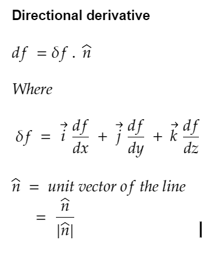

## Consistent condition

- If at least one set of values of the variables of the eqaution can be found to satisfy all the equation.
- If the rank of coefficient matrix is equal to the rank of agumented matrix of the equations.

## Solving equation with Gauss elimination method

    Step 1: Make the agumented matix of the equations.
    Step 2: Make coefficient of first variable from all the rows except first row to 0
    Step 3: Make coefficent of second variable from all the rows except first and second rows to 0
    Step 4: Continue to make 0 for all the vaiables as needed to 0 except the last variable.
    Step 5: Using the resultant agumented matrix we find the value of last variable.
    Step 6: Using that value we find value of second last variable and so on.

## Cayley-Hamilton Thoerm

- For a matrix A, we have |A-lamda*I| = 0 where I = Identity matrix of same order as A
- After solving |A-lamda*I| = 0 we get a characteristics equation of the matrix C(x)
- We replace all the lamda of C(X) with matrix A and check if it satisfies the condition (i.e it is equal to Zero Matrix)
- If yes we can find the inverse of the martix A by multiplying the characteristics equation C(x) with A inverse and solving it.

## p-test for convergent testing

    Step 1: Find the general term of the series. [U{n}]
    Step 2: Find the limit of the general term.
    Step 3: If the limit is equal to 0 then the series is convergent Else it is divergent or oscilating.

## ratio-test for convergent test

    Step 1: Find the general term of the series. [U{n}]
    Step 2: Find the general term + 1 of the series. [U{n+1}]
    Step 3: Find the limit of the ratio U{n+1} by U{n}
            if (limit == 0) raduis = infinity, interval of convergence(-infinity , infinity)
            if (limit == infinity) raduis = 0, interval of convergence (center of the series)
            if (limit == 1/R*|X-C|) raduis = R, interval of convergence (-R+C, R+C) --> also check the convergence at -R+C and R+C

<!-- ## Fourier Series

## Fourier Series for cosine and sine

 -->

## Directional derivative of function f

